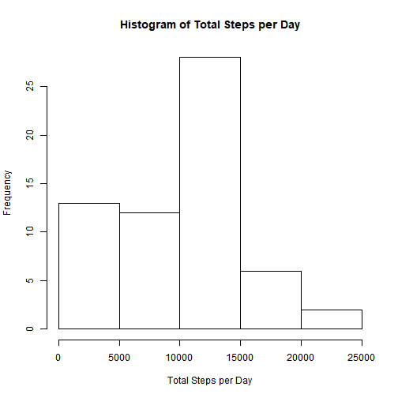
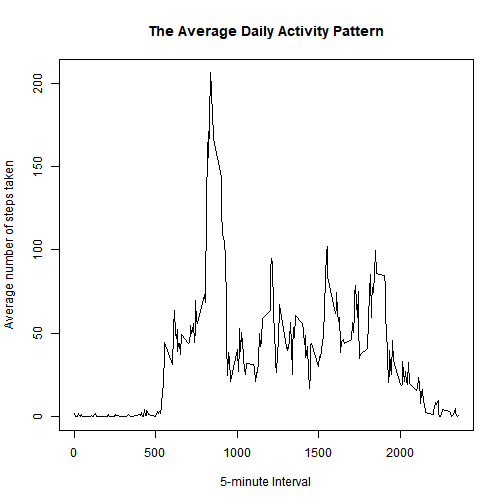
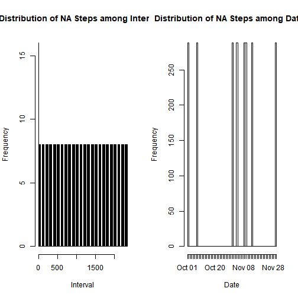
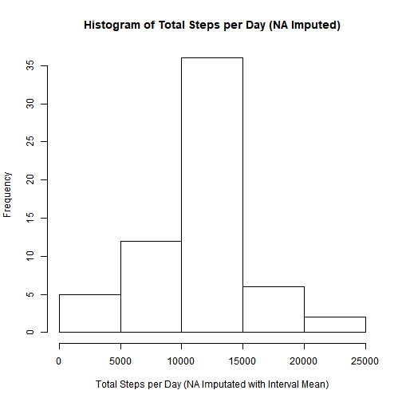
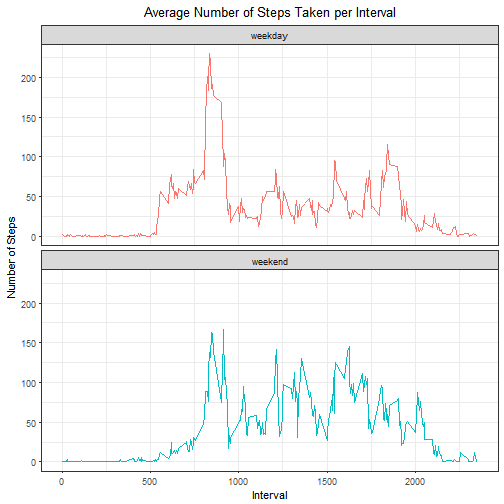

## Loading and preprocessing the data

Load the data from activity.csv.


```r
#  If file not already exists, download and unzip the file:
if(!file.exists("activity.csv")) {
        temp <- tempfile()
        download.file("http://d396qusza40orc.cloudfront.net/repdata%2Fdata%2Factivity.zip",temp)
        unzip(temp,"activity.csv")
        unlink(temp)
}
#load data
data <- read.csv("activity.csv")
```

Explore data structure.

```r
str(data)
```

```
## 'data.frame':	17568 obs. of  3 variables:
##  $ steps   : int  NA NA NA NA NA NA NA NA NA NA ...
##  $ date    : Factor w/ 61 levels "2012-10-01","2012-10-02",..: 1 1 1 1 1 1 1 1 1 1 ...
##  $ interval: int  0 5 10 15 20 25 30 35 40 45 ...
```

```r
summary(data)
```

```
##      steps                date          interval     
##  Min.   :  0.00   2012-10-01:  288   Min.   :   0.0  
##  1st Qu.:  0.00   2012-10-02:  288   1st Qu.: 588.8  
##  Median :  0.00   2012-10-03:  288   Median :1177.5  
##  Mean   : 37.38   2012-10-04:  288   Mean   :1177.5  
##  3rd Qu.: 12.00   2012-10-05:  288   3rd Qu.:1766.2  
##  Max.   :806.00   2012-10-06:  288   Max.   :2355.0  
##  NA's   :2304     (Other)   :15840
```

Transform the date column from factor to Date variable. Also note that there are missing values in steps.


```r
data$date <- as.Date(as.character(data$date))
```

## What is mean total number of steps taken per day?

First, calculate the total number of steps taken per day.


```r
library(dplyr)
```

```
## Warning: package 'dplyr' was built under R version 3.4.4
```

```r
step_day <- data %>% group_by(date) %>% summarise(total_steps = sum(steps,na.rm=TRUE))
```

Now get a hisogram plot of total steps per day.

```r
hist(step_day$total_steps, main="Histogram of Total Steps per Day", xlab= "Total Steps per Day")
```



Calculate and report the mean and median of the total number of steps taken per day.

```r
mean(step_day$total_steps, na.rm=TRUE)
```

```
## [1] 9354.23
```

```r
median(step_day$total_steps, na.rm=TRUE)
```

```
## [1] 10395
```
The mean total steps taken per day is 9354.23, and the median total steps taken per day is 10395.

## What is the average daily activity pattern?
Make a time series plot of the 5-minute interval and the average number of steps taken, averaged across all days.

```r
step_interval <- data %>% group_by(interval) %>% summarise(mean_steps = mean(steps, na.rm=TRUE))
with(step_interval,plot(mean_steps ~ interval, type="l", 
                        xlab="5-minute Interval", 
                        ylab="Average number of steps taken",
                        main = "The Average Daily Activity Pattern"))
```



Which 5-minute interval, on average across all the days in the dataset, contains the maximum number of steps?

```r
step_interval[which.max(step_interval$mean_steps),]
```

```
## # A tibble: 1 x 2
##   interval mean_steps
##      <int>      <dbl>
## 1      835       206.
```
The time interval 835 has the maximum average number of steps (206 steps) across all the days in the dataset.

## Imputing missing values
Note that there are a number of days/intervals where there are missing values (coded as \color{red}{\verb|NA|}NA). The presence of missing days may introduce bias into some calculations or summaries of the data.

Calculate and report the total number of missing values in the dataset (i.e. the total number of rows with \color{red}{\verb|NA|}NAs)

```r
sum(is.na(data))
```

```
## [1] 2304
```

There are 2304 rows with missing values. Now we check the distribution of the missing values among dates and time intervals.

```r
par(mfcol=c(1,2))
hist(data[is.na(data$step),]$interval,breaks=480,xlab="Interval",main="Distribution of NA Steps among Intervals",freq=TRUE)
hist(data[is.na(data$step),]$date,breaks=61,xlab="Date",main="Distribution of NA Steps among Dates",freq=TRUE)
```



Since the missing step values are only from 8 dates, but evenly distributed on the time intervals. It will introduce less bias using interval mean to impute the missing values.

Now create a new dataset that is equal to the original dataset but with the missing data filled in. 

```r
# devide the dataset into two sets: with or without na values 
data_na <- data[is.na(data$step),]
data_no_na <- data[!is.na(data$step),]

# calculate the interval mean 
interval_mean <- data_no_na%>% group_by(interval) %>% summarise(steps = mean(steps))

# impute the na values with interval mean
data_na_imputed <- merge(data_na[c("date","interval")], interval_mean, by="interval")

# combine a new dataset
data_imputed <- rbind(data_no_na, data_na_imputed[,c("steps","date","interval")]) 
```

Make a histogram of the total number of steps taken each day and Calculate and report the mean and median total number of steps taken per day. 

```r
step_day_imputed <- data_imputed %>% group_by(date) %>% summarise(total_steps = sum(steps))
  hist(step_day_imputed$total_steps, main="Histogram of Total Steps per Day (NA Imputed)", xlab= "Total Steps per Day (NA Imputated with Interval Mean)")
```



```r
mean(step_day_imputed$total_steps, na.rm=TRUE)
```

```
## [1] 10766.19
```

```r
median(step_day_imputed$total_steps, na.rm=TRUE)
```

```
## [1] 10766.19
```

After imputing NA values with interval mean, both the mean and median total steps per day are 10766.19 steps, compared to mean of 9354.23 and median of 10395 total steps per day while having NA values removed from the dataset. This suggests that imputing NA values with interval mean removed the left skewness of the distribution of total daily number of steps. 

## Are there differences in activity patterns between weekdays and weekends?

```r
# create a day_of_week factor variable with two levels: weekend and weekday
data_imputed$day_of_week <- as.factor(ifelse(weekdays(data_imputed$date) %in% c("Saturday","Sunday"),"weekend","weekday"))

# summarize and get averge steps taken, averaged across all weekday days or weekend days (y-axis)
steps_weekday <- data_imputed %>% group_by(interval,day_of_week) %>% summarise(avg_steps = mean(steps))

#make the plot
library(ggplot2)
ggplot(steps_weekday, aes(x=interval, y=avg_steps, color=day_of_week))+ 
  geom_line()+ 
  facet_wrap(~day_of_week,nrow=2)+
  labs(x="Interval", y="Number of Steps",title="Average Number of Steps Taken per Interval")+
  theme_bw() + theme(plot.title = element_text(hjust = 0.5))+ theme(legend.position="none")
```



While during the weekdays the average number of steps are highest in the morning rush hour time, the steps are more evenly distributed among all day-time intervals during the weekends. 


